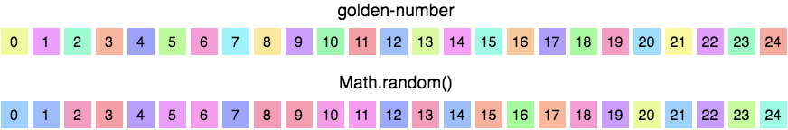

# golden-number

> A tiny [Golden ratio](https://en.wikipedia.org/wiki/Golden_ratio) based number generator

> Only 49 bytes minified and gzipped

```
npm install golden-number
```

then

```js
const createGenerator = require('golden-number');

const generator = createGenerator();
const num = generator(); //=> 0.70693204169029
```

## How & why

Each produced value is a modulo 1 of the sum of the previous value (or a seed) and the golden ratio. Values are uniformly distributed but appear in a predictable repeatable pattern where neighbor values can't appear one after another. This can be used for generating a diverse set of values, for example we can use generated values for hue in [HSL](https://en.wikipedia.org/wiki/HSL_and_HSV) for generating colors. Compare it to a plain `Math.random()`:

```js
element.style.backgroundColor = `hsl(${Math.round(randomValue * 360)}, 83%, 71%)`;
```



## API

### createGenerator(seed?: number): () => number

Create Golden ratio based number generator function.

Returns a function that will return a new number on each call.

* `seed` - A float number between 0 and 1. Default is a random number from Math.random()

## Acknowledgments

Inspired by [How To Generate Random Colors Programmatically](https://martin.ankerl.com/2009/12/09/how-to-create-random-colors-programmatically/).

## License

MIT
